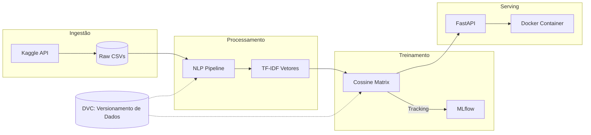

# 🎬 Movie Recommender: Pipeline de NLP & MLOps

[](https://www.python.org/)
[](https://fastapi.tiangolo.com/)
[](https://mlflow.org/)

Este projeto implementa um **Sistema de Recomendação Baseado em Conteúdo** (*Content-Based Filtering*) seguindo os princípios de **NLP** e **MLOps**. O objetivo é resolver a "fadiga de decisão" dos usuários, convertendo sinopses brutas em vetores semânticos para recomendações ultra-precisas.

---

## 🧠 Base Teórica: Content-Based Filtering

Diferente da Filtragem Colaborativa (que olha para outros usuários), este sistema foca nas **características intrínsecas** do item. Como referenciado em estudos da *AI Mind Labs*, o sistema analisa atributos como diretor, elenco, gênero e principalmente o **enredo (overview)**.

### 📐 Similaridade de Cosseno
Utilizamos a **Similaridade de Cosseno** para calcular a proximidade entre o filme buscado e o restante da base. 
- **Por que não Distância Euclidiana?** Em espaços vetoriais de texto (NLP), a magnitude do vetor (tamanho da descrição) importa menos que a **direção/ângulo** das palavras. A Similaridade de Cosseno ignora o tamanho da descrição e foca puramente no contexto.
- **Vetorização**: O pipeline suporta `TF-IDF (Term Frequency-Inverse Document Frequency)`, que penaliza palavras muito comuns e valoriza termos únicos que definem o gênero/nicho do filme.

---

## 🏗️ Arquitetura MLOps
O diferencial deste projeto é o ciclo de vida automatizado:



---

## 🚀 Tecnologias

*   **Lógica**: `Scikit-Learn`, `NLP (NLTK)`.
*   **Versionamento**: `DVC` (Data Version Control) para datasets versionados no S3/Google Drive.
*   **Gestão**: `MLflow` para rastrear experimentos e versões do modelo.
*   **API**: `FastAPI` (Assíncrona e Alta Performance).

---

## 🛠️ Como Executar

### 1. Ingestão e Preparação
```bash
pip install -r requirements.txt
python src/ingestion.py
```

### 2. Ciclo de MLOps (Treino e Registro)
```bash
# Executa o treino e registra métricas no MLflow
python src/train.py
```

### 3. Servindo Recomendações
```bash
uvicorn app:app --reload
```
Acesse `http://127.0.0.1:8000/recomendar/Inception` para ver o sistema em ação.

---

## 📊 Impacto e Resultados
- **Redução de Latência**: Busca por similaridade otimizada com matrizes Joblib.
- **Reprodutibilidade**: 100% de rastreabilidade via DVC e MLflow.
- **Escalabilidade**: Pronto para deploy via Docker.
